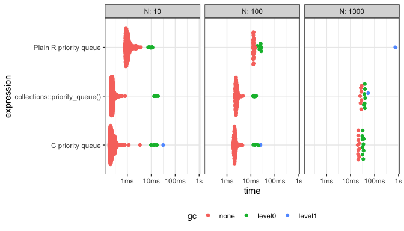

<!-- README.md is generated from README.Rmd. Please edit that file -->

# priorityqueue

<!-- badges: start -->


[](https://github.com/coolbutuseless/priorityqueue/actions)
<!-- badges: end -->

`priorityqueue` is a package with two [priority
queue](https://en.wikipedia.org/wiki/Priority_queue) implementations for
R: one written in C, and the other written in plain R.

Both of these are *max-priority-queues* i.e. “popping” from the queue
returns the value with highest priority.

These priority queues support any R object. The priority can be any
finite `double()` value.

## What’s in the box

Two priority queue implementations with identical call APIs.

-   Pure R priority queue:
    -   `rpq_create()`, `rpq_insert(rpq, obj, priority)`, `rpq_pop(rpq)`
-   C-based priority queue:
    -   `cpq_create()`, `cpq_insert(cpq, obj, priority)`, `cpq_pop(cpq)`

## Installation

You can install from
[GitHub](https://github.com/coolbutuseless/priorityqueue) with:

``` r
# install.package('remotes')
remotes::install_github('coolbutuseless/priorityqueue')
```

## Example

Priority queues are a data-structure to store objects along with a
priority with each object.

When *popping* a value off the queue, the object with the largest
priority is returned.

``` r
library(priorityqueue)

rpq <- rpq_create()
rpq_is_empty(rpq)
#> [1] TRUE

rpq_insert(rpq, obj = "#RStats", priority = 2)
rpq_insert(rpq, obj = "hello"  , priority = 3)
rpq_insert(rpq, obj = 2 * 2    , priority = 1)

rpq_length(rpq)
#> [1] 3

# Retrieve the objects from largest priority to smallest
rpq_pop(rpq)
#> [1] "hello"
rpq_pop(rpq)
#> [1] "#RStats"
rpq_pop(rpq)
#> [1] 4
```

## Rationale

I needed a data structure in R which would allow me to insert/pop items
based upon a *priority* value - what is known as a *priority queue*.

I wrote a quick solution in R that met my basic needs i.e. an
environment containing a list of objects and a vector of values, plus
some standard functions to manipulate. This code is the basis of the
`rpq_*` functions in this package.

I then wondered how this could be done with C, and as a learning
exercise I wrote a minimal priority queue in C which supported R
objects. This was tidied to be the C prioirty queue (`cpq_*`) in this
package.

## Timing

In general the C implementation is faster and uses less memory than the
R implementation (no surprises there).

For larger queues, the C implementation can be \~10x faster and use
1/30th the memory.

This implementation of a priority queue compares favourably with the
priority queue included in the
[{collections}](https://cran.r-project.org/package=collections) package
on CRAN.

<details>
<summary>
Click to show/hide the timing code
</summary>

``` r
r_priority_queue <- function(N) {
  set.seed(1)
  rpq <- rpq_create()
  
  for (i in 1:(N*2)) {
    rpq_insert(rpq, 1, runif(1))
    rpq_insert(rpq, 1, runif(1))
  }
  
  for (i in 1:N) {
    rpq_insert(rpq, 1, runif(1))
    rpq_insert(rpq, 1, runif(1))
    rpq_pop(rpq)
    rpq_pop(rpq)
    rpq_pop(rpq)
  }
}


cpq_priority_queue <- function(N) {
  set.seed(1)
  cpq <- cpq_create()
  
  for (i in 1:(N*2)) {
    cpq_insert(cpq, 1, runif(1))
    cpq_insert(cpq, 1, runif(1))
  }
  
  for (i in 1:N) {
    cpq_insert(cpq, 1, runif(1))
    cpq_insert(cpq, 1, runif(1))
    cpq_pop(cpq)
    cpq_pop(cpq)
    cpq_pop(cpq)
  }
}


collections_priority_queue <- function(N) {
  set.seed(1)
  colq <- collections::priority_queue()
  
  for (i in 1:(N*2)) {
    colq$push(1, runif(1))
    colq$push(1, runif(1))
  }
  
  for (i in 1:N) {
    colq$push(1, runif(1))
    colq$push(1, runif(1))
    colq$pop()
    colq$pop()
    colq$pop()
  }
}


res <- bench::press(
  N = c(10, 100, 1000),
  bench::mark(
    `Plain R priority queue` = r_priority_queue(N), 
    `C priority queue` = cpq_priority_queue(N),
    `collections::priority_queue()` = collections_priority_queue(N)
  )
)
```

</details>

    #> Warning: Some expressions had a GC in every iteration; so filtering is disabled.

| expression                     |    N |     itr/sec | mem\_alloc |
|:-------------------------------|-----:|------------:|-----------:|
| Plain R priority queue         |   10 |  326.554335 |   384.12KB |
| C priority queue               |   10 | 2899.744044 |   226.52KB |
| collections::priority\_queue() |   10 | 2991.170859 |   278.94KB |
| Plain R priority queue         |  100 |   28.414768 |     5.88MB |
| C priority queue               |  100 |  336.337200 |     1.48MB |
| collections::priority\_queue() |  100 |  306.699672 |     1.47MB |
| Plain R priority queue         | 1000 |    1.145615 |   445.05MB |
| C priority queue               | 1000 |   35.713291 |    14.73MB |
| collections::priority\_queue() | 1000 |   29.016613 |    14.71MB |



## Technical Bits

Plain R priority queue

-   Implemented as an environment with storage for a list of objects and
    a vector of priorities.
-   New objects and their priorities are appended to the list/vector in
    the environment.
-   When a value is *popped*, the objects are sorted by the priorities,
    and the first object is returned.
-   The R version is slightly optimized for the situation where there
    are consecutive reads, in that it does not re-sort the objects if no
    new objects have been added to the queue since the last pop
    operation.

C priority queue

-   A heap-based priority queue.
-   Creating a `cpq` creates an ExternalPointer to a `cpq_t` object
    which contains the queue and other information all entirely
    within C.
-   An R list is attached to this ExternalPointer in C (as a *protected*
    item on the pointer). When new R objects are added to the priority
    queue, they are also added to this list to prevent them from being
    garbage collected.

## Related Software

-   The [{collections}](https://cran.r-project.org/package=collections)
    package already includes a very good priority queue and bunch of
    other useful stuff.

## Acknowledgements

-   R Core for developing and maintaining the language.
-   CRAN maintainers, for patiently shepherding packages onto CRAN and
    maintaining the repository
